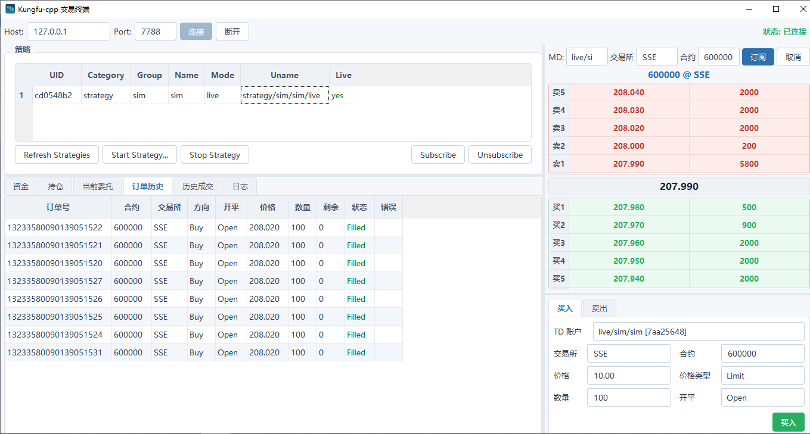

# Kungfu-cpp 交易终端（Qt 客户端）

`kf_client` 是 kungfu-cpp 的 Qt Widgets 图形客户端，通过原生 TCP 连接 [kf_api](../src/api) 服务，提供策略管理、行情五档盘口、手动下单、持仓资金与日志的一站式交易终端界面。



## 界面布局

主窗口为四象限布局，通过 QSplitter 分隔，可自由拖动调整各区域大小：

```
┌──────────────────────────────┬─────────────────────┐
│ 左上: 策略列表                │ 右上: 行情 BOOK       │
│  启动/停止/订阅/退订           │  MD/交易所/合约 + 订阅 │
│                              │  卖5..卖1 / 买1..买5  │
├──────────────────────────────┼─────────────────────┤
│ 左下: 数据标签页              │ 右下: 手动下单        │
│  资金 | 持仓 | 当前委托(撤单)  │  [买入] [卖出] 两个页 │
│  订单历史 | 历史成交 | 日志    │  参数输入 + 下单按钮  │
└──────────────────────────────┴─────────────────────┘
```

- **左上 策略列表**（[StrategyTab](src/StrategyTab.cpp)）：展示所有策略 location（mode/group/name/uid/是否存活），支持启动、停止、订阅、退订。
- **左下 数据标签页**（[LeftBottomTabs](src/LeftBottomTabs.cpp)）：
  - 资金 / 持仓：实时推送 + 手动刷新；
  - 当前委托：活动订单列表，选中后可按页面顶部选择的 TD 账户撤单；
  - 订单历史 / 历史成交：订阅策略后的回报流水；
  - 日志：全局操作与事件日志。
- **右上 行情 BOOK**（[OrderBook](src/OrderBook.cpp)）：选择 MD 源并输入交易所/合约后订阅，上下两块分别展示卖 5 档与买 1..买 5 档的价格/数量，并显示最新价。
- **右下 手动下单**（[OrderEntry](src/OrderEntry.cpp)）：买入 / 卖出两个选项页，每页包含 TD 账户、交易所、合约、价格、价格类型、数量、开平标志，以及相应颜色的下单按钮。

## 构建与运行

### 依赖

- Windows + MSVC（Visual Studio 2022）
- Qt 6.8（`msvc2022_64`）

### 构建

```powershell
cmake -S kungfu-cpp/client -B kungfu-cpp/client/build -G "Visual Studio 17 2022" -A x64 -DCMAKE_PREFIX_PATH=D:/Qt/6.8.0/msvc2022_64
cmake --build kungfu-cpp/client/build --config Release --target kf_client
```

产物：`kungfu-cpp/client/build/Release/kf_client.exe`。

### 运行

先启动 kungfu 服务（`kf_master`、`kf_ledger`、`kf_api` 及 MD/TD 进程），再运行客户端：

```powershell
d:\workspace\repos\rewrite-kungfu\kungfu-cpp\client\build\Release\kf_client.exe
```

在顶部连接条输入 kf_api 的地址（默认 `127.0.0.1:7788`），点击「连接」。

## 典型使用流程

1. **连接** — 连接成功后客户端自动拉取 trading day、locations、strategies；
2. **管理策略** — 左上选择策略行，启动/停止，或订阅/退订（订阅后该策略的订单、成交、持仓、资金才会推送到左下各页）；
3. **订阅行情** — 右上选择 MD 源，输入交易所与合约，点击「订阅」，五档 BOOK 开始刷新；
4. **手动下单** — 右下选择 TD 账户，填写合约/价格/数量，在「买入」或「卖出」页点击按钮报单；在「当前委托」页选中订单可撤单。

## 目录结构

```
client/
├── CMakeLists.txt          # 构建脚本（禁用 AUTOMOC，使用手写 moc）
├── app.rc                  # Windows 资源文件（嵌入 resources/app.ico 为 exe 图标）
├── docs/client.PNG         # 界面截图
├── resources/app.ico       # 程序图标
├── tools/
│   ├── gen_icon.ps1        # 重新生成 app.ico（多 entry：32x32 BMP + 256 PNG）
│   └── gen_moc.ps1         # 生成/维护手写 moc 文件
└── src/
    ├── main.cpp            # 入口 + 全局 QSS 样式
    ├── MainWindow.h/.cpp   # 主窗口：连接条 + 四象限布局
    ├── ApiClient.h/.cpp    # TCP 客户端：帧编解码 + JSON 协议 + 推送信号
    ├── StrategyTab.h/.cpp  # 左上：策略管理
    ├── LeftBottomTabs.h/.cpp # 左下：资金/持仓/委托/成交/日志
    ├── OrderBook.h/.cpp    # 右上：五档盘口
    ├── OrderEntry.h/.cpp   # 右下：手动下单
    └── moc_*.cpp           # 手写 moc 产物（Qt6 revision-12 格式）
```

## 协议与实现要点

- 与 kf_api 使用原生 TCP，帧格式为 `[4 字节大端长度][消息体]`；
- 请求/响应为 JSON，`request_id` 用于匹配异步响应；行情/订单/成交/持仓/资金以二进制结构推送并转换为 `QuoteInfo` 等结构体再经信号分发；
- 订单号 `order_id` 是 64 位整数（可能超出 JSON number 的 2^53 精度），因此撤单时不回传 order_id 对应的 TD，而是由用户在「当前委托」页显式选择 TD 账户；
- 本工程禁用 CMake AUTOMOC（环境策略拦截 moc.exe），所有 Q_OBJECT 类的元对象代码为手写 `moc_*.cpp`；slots 通过函数指针版 `QObject::connect` 连接，无需在元对象表中登记，新增 signals 才需更新对应 moc 文件；
- 程序图标由 `tools/gen_icon.ps1` 用 System.Drawing 生成并经 `app.rc` 嵌入 exe（资源管理器/任务栏显示），运行时 `main.cpp` 同时加载同一 ico 设置窗口图标。

## 常见问题

- **连接后无数据**：确认 `kf_api` 已启动并监听 7788；策略数据需先在左上订阅对应策略。
- **下单按钮灰色/报错无 TD**：确认 locations 中存在 category=td 的账户，且对应进程已启动。
